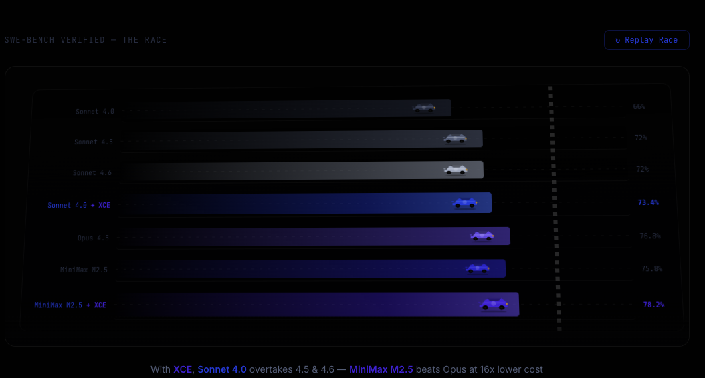

# Xanther CLI

<p align="center">
  
</p>

<p align="center">
  <strong>Index your codebase. Supercharge your coding agent.</strong>
</p>

<p align="center">
  <a href="https://xanther.ai">Website</a> •
  <a href="https://app.xanther.ai">Dashboard</a> •
  <a href="https://discord.gg/YaBekKpR">Discord</a> •
  <a href="https://github.com/Xanther-Ai/xce-mcp">XCE MCP Server</a> •
  <a href="https://x.com/xantherai">Twitter</a>
</p>

---

## What is Xanther CLI?

Xanther CLI indexes your codebase into the Xanther Context Engine (XCE), giving your coding agent deep architectural understanding of your code. It works with any git repository — public, private, GitHub, GitLab, Bitbucket, or local-only.

**v0.3.0** — The CLI now checks if your repo is already indexed (community repos are free), outputs MCP config with `repo_id` embedded in the URL, and generates steering files for all major IDEs.

## Install

```bash
npm install -g xanther-cli
```

Or use directly with npx (no install needed):

```bash
npx xanther-cli init --api-key xce_your_key_here
```

## Quick Start

### 1. Get your API key

Sign up at [app.xanther.ai](https://app.xanther.ai) and generate an API key from the dashboard.

### 2. Initialize and index your repo

```bash
cd your-project
npx xanther-cli init --api-key xce_your_key_here
```

**What happens:**

1. Checks if your repo is already indexed (community repos like Django, Flask, lobe-chat are pre-indexed — no wait needed)
2. If not indexed, submits your codebase for full indexing (respects `.gitignore`)
3. Installs a `post-commit` git hook for automatic incremental updates
4. Generates steering files for your IDE (`.kiro/steering/xce.md`, `CLAUDE.md`, `.cursorrules`, etc.)
5. **Outputs your MCP config** with `repo_id` in the URL — paste it into your IDE

### 3. Connect your coding agent

After `init` completes, the CLI prints your MCP config:

```json
{
  "mcpServers": {
    "xanther-xce": {
      "url": "https://mcp.xanther.ai/sse?repo_id=your-user-id:your-project",
      "headers": {
        "Authorization": "Bearer xce_your_key_here"
      }
    }
  }
}
```

Paste this into your IDE's MCP config file:

| IDE | Config File |
|---|---|
| Kiro | `.kiro/settings/mcp.json` |
| Claude Code | `~/.claude/mcp.json` |
| Cursor | `.cursor/mcp.json` |
| Windsurf | `.windsurf/mcp.json` |
| OpenCode | `~/.config/opencode/config.json` |
| Cline | `.vscode/mcp.json` |

That's it. Your agent now has deep codebase context on every interaction.

## Commands

### `xanther-cli init`

Initialize and perform a full index of the current repository.

```bash
xanther-cli init --api-key xce_your_key_here
```

Options:
- `--api-key` — Your Xanther API key (required on first run, saved for future use)
- `--branch` — Branch to index (default: current branch)
- `--no-hook` — Skip installing the git post-commit hook
- `--no-steering` — Skip generating steering files

**New in v0.3.0:** The CLI calls `/repos/check` to see if your repo URL is already indexed as a community repo. If it is, you get instant access without waiting for indexing.

### `xanther-cli sync`

Manually sync changes since the last index. Performs incremental indexing — only changed files are re-processed.

```bash
xanther-cli sync
```

Options:
- `--full` — Force a full re-index instead of incremental

### `xanther-cli status`

Check the indexing status of the current repository.

```bash
xanther-cli status
```

Output:
```
Repository: owner/my-project (main)
Status:     Indexed
Nodes:      12,450
Repo ID:    e4b8e418:my-project
Last sync:  2 hours ago
Plan:       Pro (8,234 / 10,000 queries used)
```

### `xanther-cli uninstall`

Remove the git hook, steering files, and local configuration.

```bash
xanther-cli uninstall
```

## How Auto-Sync Works

When you run `xanther-cli init`, it installs a `post-commit` git hook:

```
git commit → post-commit hook fires → xanther-cli sync (background)
```

The incremental sync:
1. Gets changed files from the commit (`git diff --name-only HEAD~1`)
2. Uploads only those files
3. Re-indexes affected nodes (the changed files + their dependencies)

This runs in the background and typically takes 2-5 seconds for a normal commit.

## Steering Files (Auto-Generated)

The CLI generates steering/rules files during `init` so your agent uses XCE automatically:

| IDE | File Generated |
|---|---|
| Kiro | `.kiro/steering/xce.md` |
| Claude Code | `CLAUDE.md` |
| Cursor | `.cursorrules` |
| Windsurf | `.windsurfrules` |
| Cline | `.clinerules` |

These tell the agent to call `xce_get_context` first on every task, use `xce_architecture_context` before modifying files, and use `xce_impact_analysis` before multi-file changes.

Without steering, agents may still read files directly. With steering, they consistently use XCE — resulting in ~20% fewer tokens and better results.

## Community Repos

These repos are pre-indexed and available to all users for free:

| Repository | repo_id | Nodes |
|---|---|---|
| django/django | `django-django` | 14,520 |
| lobehub/lobe-chat | `community--lobe-chat` | 92,139 |
| sympy/sympy | `community--sympy` | 8,450 |
| scikit-learn/scikit-learn | `community--scikit-learn` | 6,200 |
| matplotlib/matplotlib | `community--matplotlib` | 5,800 |
| pallets/flask | `community--flask` | 3,280 |
| pytest-dev/pytest | `community--pytest` | 3,200 |

When you run `xanther-cli init` in a community repo, the CLI detects it's already indexed and gives you instant access.

## Configuration

Xanther CLI stores its config in `.xanther/config.json` in your project root:

```json
{
  "api_key": "xce_...",
  "repo_id": "user-id:my-project",
  "api_url": "https://api.xanther.ai",
  "mcp_url": "https://mcp.xanther.ai/sse",
  "last_sync": "2026-05-07T10:00:00Z",
  "last_commit": "abc123"
}
```

Add `.xanther/` to your `.gitignore` — it contains your API key.

## Changelog

### v0.3.0 (May 2026)

- **Community repo detection**: `init` now calls `/repos/check` to see if a repo is already indexed. Community repos (Django, Flask, lobe-chat, etc.) are available instantly without waiting for indexing.
- **repo_id in MCP URL**: The CLI outputs MCP config with `?repo_id=` in the URL, so agents automatically target the correct repo without extra configuration.
- **Steering file generation**: `init` generates steering files for all major IDEs (Kiro, Claude Code, Cursor, Windsurf, Cline) so agents use XCE automatically.
- **Improved status output**: `status` now shows repo_id, node count, and plan usage.
- **TypeScript/JavaScript support**: Repos with TS/JS files are now fully supported via tree-sitter parsing.

### v0.2.1

- Initial public release
- `init`, `sync`, `status`, `uninstall` commands
- Git post-commit hook for auto-sync
- `.gitignore`-aware file upload

## Privacy

- Your code is uploaded over HTTPS to Xanther's servers for indexing
- Code is processed and stored as structured index nodes (not raw source)
- `.gitignore` patterns are respected — ignored files are never uploaded
- You can delete your indexed data anytime from the [dashboard](https://app.xanther.ai)

## Links

- [XCE MCP Server](https://github.com/Xanther-Ai/xce-mcp) — Connect your coding agent
- [Xanther Website](https://xanther.ai) — Learn more
- [Dashboard](https://app.xanther.ai) — Manage repos, API keys, usage
- [Discord](https://discord.gg/YaBekKpR) — Community and support
- [Twitter](https://x.com/xantherai) — Updates and announcements
- [Benchmark Results](https://xanther.ai/benchmarks) — SWE-bench performance data
- [npm](https://www.npmjs.com/package/xanther-cli) — Package page

## License

MIT — see [LICENSE](LICENSE) for details.
